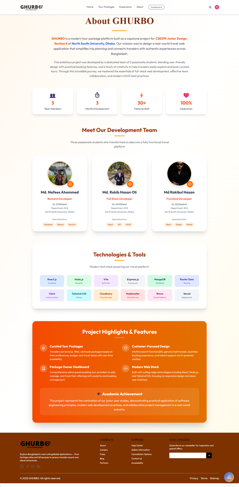
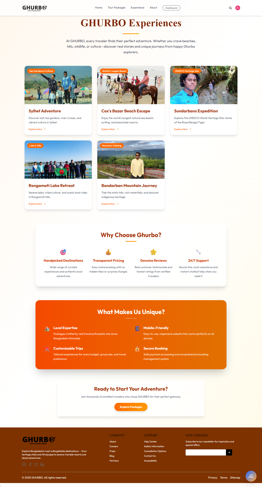
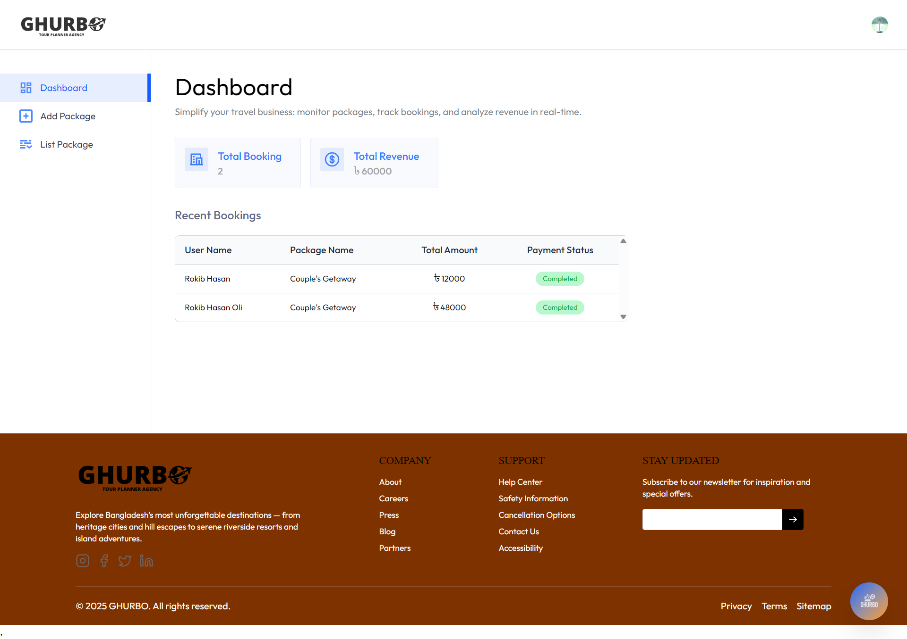
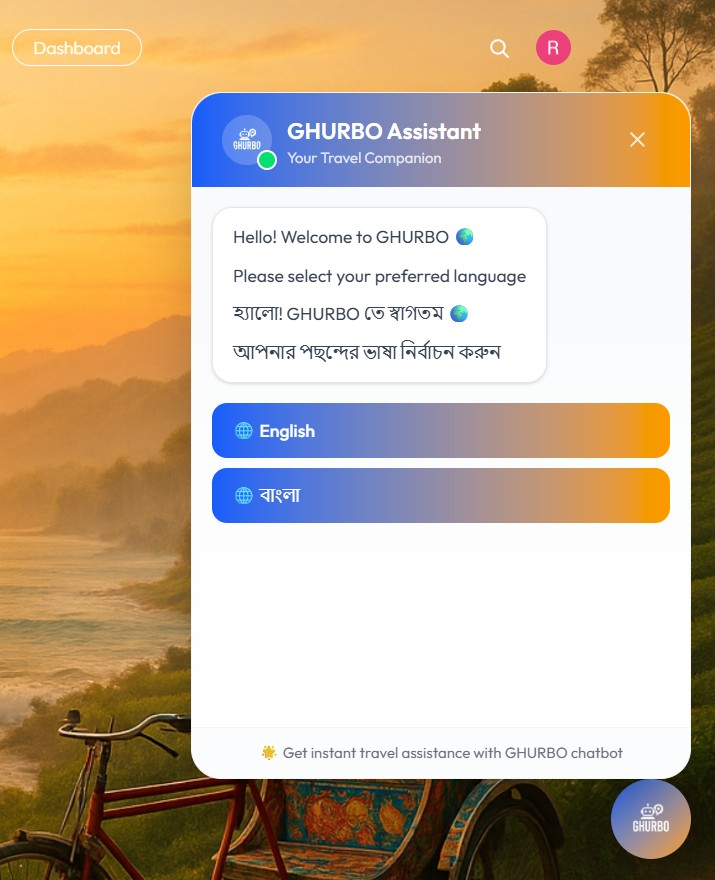
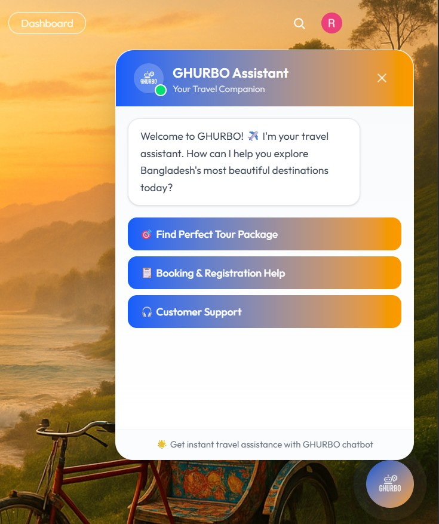
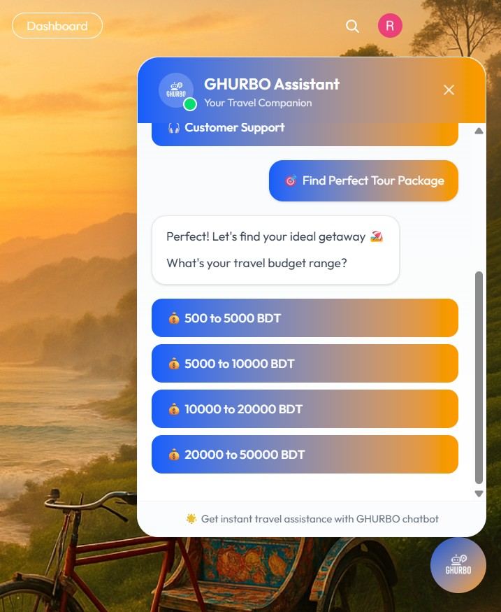

 
  

                                        

<h1 align="center">Project Name: GHURBO</h1>
<h2 align ="center">Course Number: CSE 299 Junior Design 
Section: 4  
Semester: Summer 2025  
Faculty Name: Mohammad Shifat-E-Rabbi</h2>

<h3 align="center">
Student Name: Md Nafees Ahommed 
Student ID: 2111934642  
Student Name: Md Rokib Hasan Oli 
Student ID: 2211950642 
Student Name: Md Rakibul Hasan 
Student ID: 2212346042  
Date prepared: August 2025
</h3>   

<h2>Project Name: GHURBO – Smart Tour Package Platform for Bangladesh</h2> 

<h3 id="table-of-contents">Table of Contents</h3>
<ol>
  <a href="#introduction"><li>Introduction</li></a> 
  <a href="#features"><li>Features</li></a> 
  <a href="#technology"><li>Technology Stack</li></a> 
  <a href="#businessplan"><li>Business Plan / Monetization</li></a> 
  <a href="#screenshots"><li>Project Screenshots</li></a>
  <ul>
    <a href="#home-page"><li>Home Page</li></a>
    <a href="#about-page"><li>About Page</li></a>
    <a href="#experience-page"><li>Experience Page</li></a>
    <a href="#tour-packages"><li>Tour Packages</li></a>
    <a href="#package-details"><li>Package Details & Booking</li></a>
    <a href="#check-availability"><li>Check Availability</li></a>
    <a href="#book-now"><li>Book Now</li></a>
    <a href="#my-bookings"><li>My Bookings</li></a>
    <a href="#dashboard"><li>Dashboard (Package Owner)</li></a>
    <a href="#package-listings"><li>Package Listings</li></a>
    <a href="#add-package"><li>Add Package</li></a>
    <a href="#package-registration"><li>Package Registration Form</li></a>
    <a href="#chatbot1"><li>AI Chatbot (Step 1)</li></a>
    <a href="#chatbot2"><li>AI Chatbot (Step 2)</li></a>
    <a href="#chatbot3"><li>AI Chatbot (Step 3)</li></a>
    <a href="#email-verification"><li>Email Verification for Login / Delete</li></a>
    <a href="#booking-confirmation"><li>Booking Confirmation Email</li></a>
  </ul> 
  <a href="#conclusion"><li>Conclusion</li></a> 
</ol>

<h2 id="introduction">1. Introduction</h2>

GHURBO is a modern tour package platform built as a capstone project for <strong>CSE299 Junior Design</strong> at North South University, Dhaka. 
Our mission is to design a real-world travel web application that simplifies trip planning and connects travelers with authentic experiences across Bangladesh.
The platform blends user-friendly design, curated packages, AI chatbot assistance, and secure booking to make travel planning seamless and enjoyable.

<h2 id="features">2. Features</h2>
<ul>
  <li><strong>Curated Tour Packages:</strong> Browse, filter, and book packages based on preferences, budget, and travel dates with real-time availability.</li>
  <li><strong>Exclusive Offers:</strong> Limited-time deals and discounts to make travel more affordable.</li>
  <li><strong>AI Travel Assistant:</strong> Multi-language chatbot for instant travel help, recommendations, and booking assistance.</li>
  <li><strong>Package Owner Dashboard:</strong> Admin tools for providers to manage packages, bookings, and analytics.</li>
  <li><strong>Secure Booking & Payments:</strong> Reliable transactions with email confirmations.</li>
  <li><strong>Mobile-Friendly Design:</strong> Responsive interface for all devices.</li>
</ul>

<h2 id="technology">3. Technology Stack</h2>
<h3>3.1 Frontend:</h3>
<ul>
  <li>React.js</li>
  <li>Vite</li>
  <li>Tailwind CSS</li>
  <li>React Router Dom</li>
</ul>
<h3>3.2 Backend:</h3>
<ul>
  <li>Node.js</li>
  <li>Express.js</li>
  <li>MongoDB</li>
</ul>
<h3>3.3 Authentication & Tools:</h3>
<ul>
  <li>Clerk Authentication</li>
  <li>Cloudinary (Cloud Storage)</li>
  <li>Nodemailer & Brevo (Email Services)</li>
  <li>Vercel Deployment</li>
</ul>

<h2 id="businessplan">4. Business Plan / Monetization</h2>

GHURBO aims to start as a free platform to attract users and build trust. Revenue will be generated through:

<ul>
  <li>Partner listings (hotels, guides, experiences)</li>
  <li>Premium package promotions</li>
  <li>Service fees for bookings</li>
  <li>Subscription plans for tour providers</li>
</ul>

<h2 id="screenshots">5. Project Screenshots</h2>

<h3 id="home-page">Home Page</h3>

<h3 id="about-page">About Page</h3>

<h3 id="experience-page">Experience Page</h3>

<h3 id="tour-packages">Tour Packages</h3>

<h3 id="package-details">Package Details & Booking</h3>

<h3 id="check-availability">Check Availability</h3>

<h3 id="book-now">Book Now</h3>

<h3 id="my-bookings">My Bookings</h3>

<h3 id="dashboard">Dashboard (Package Owner)</h3>

<h3 id="package-listings">Package Listings</h3>

<h3 id="add-package">Add Package</h3>

<h3 id="package-registration">Package Registration Form</h3>

<h3 id="chatbot1">AI Chatbot (Step 1)</h3>

<h3 id="chatbot2">AI Chatbot (Step 2)</h3>

<h3 id="chatbot3">AI Chatbot (Step 3)</h3>

<h3 id="email-verification">Email Verification for Login / Delete</h3>

<h3 id="booking-confirmation">Booking Confirmation Email</h3>

<h2 id="conclusion">6. Conclusion</h2>

GHURBO offers a complete travel planning and booking solution tailored for Bangladesh. From curated packages and exclusive offers to AI-powered assistance and secure payments, the platform is designed to simplify travel while supporting local tourism businesses. This project showcases our full-stack development skills, teamwork, and dedication to building a real-world product.

